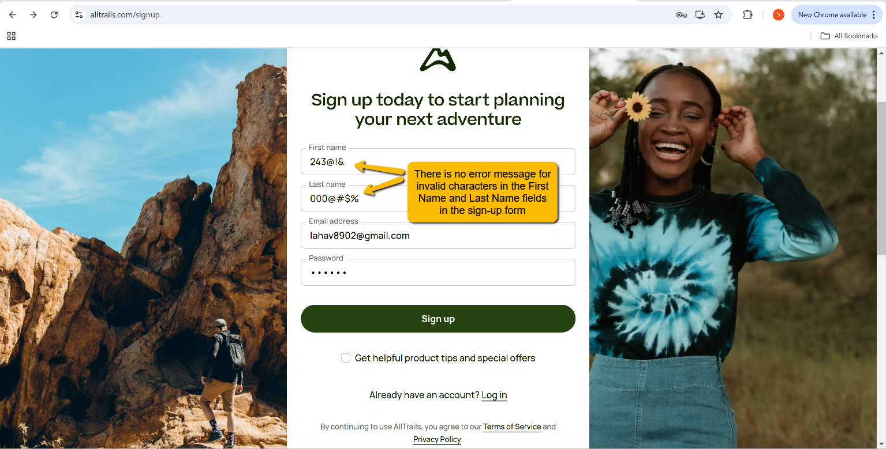
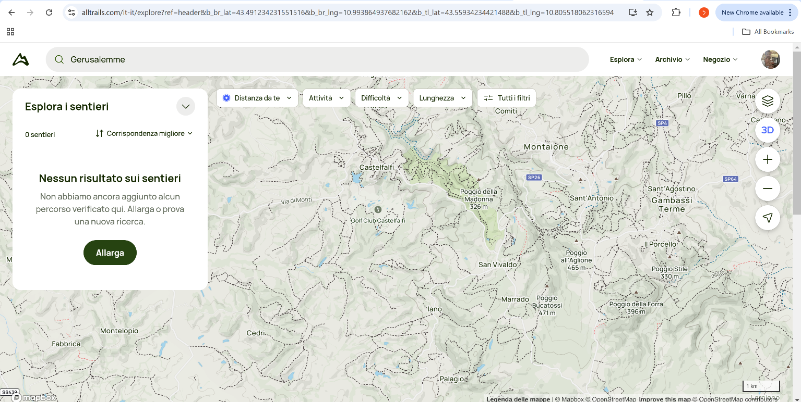
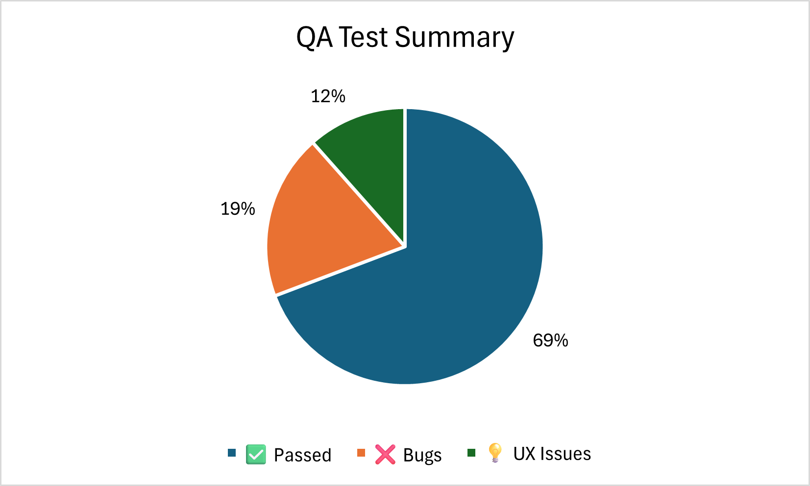

# AllTrails QA Final Project - Manual Testing

**Quick links:**  
[STP](./docs/STP.md) · [STD](./docs/STD.md) · [STR](./docs/STR.md) · [Screenshots](./screenshots/) · [Live project](https://lahavmauda.github.io/alltrails-final-project/)

## Test coverage overview

**Legend:** ✅ passed · 🟡 in progress · ❌ open · 🔁 to regress · 🧪 exploratory

| Area          | Scenarios covered                                   | Status | Notes |
|---------------|------------------------------------------------------|--------|-------|
| Login         | valid, invalid, empty, edge length, lockout timer    | ✅     | edge cases verified with screenshots |
| Search        | keyword, filters, empty query, no results            | ✅     | verified on desktop and mobile |
| Navigation    | header, footer, category links, back-forward flows   | ✅     | cross page linking checked |
| Account       | profile view, edit profile, validation messages      | 🟡    | edit form validations in progress |
| Error states  | 404 page, network fail simulation                    | 🧪    | exploratory notes in STR |

**Traceability:**
- Design → [STD](./docs/STD.md)
- Plan → [STP](./docs/STP.md)
- Execution and defects → [STR](./docs/STR.md) and [Issues](../../issues?q=is%3Aissue+label%3Abug)

**Next planned checks:**
- 🔁 mini regression after Account fixes
- 🧪 exploratory on slow networks and small viewports

## 🌟 Overview
Hands-on manual QA project for a live web app.  
Focus on test planning, test case design, sanity and regression runs, clear defect reporting, and final summary.

**Live demo:** https://lahavmauda.github.io/alltrails-final-project/

---

## 🧭 Scope and Goals
- Validate core user flows and critical paths
- Cover sanity and selected regression areas
- Document tests so anyone can reproduce results
- Report defects with evidence and clear expected vs actual

---

## 🗂 Project Structure
- `index.html` - project landing and samples
- `README.md` - project description and quick navigation
- `AllTrails QA Final Project – Manual Testing.pdf` - full STR export (encoded link below)

> Full STR PDF:  
> [Open report](AllTrails%20QA%20Final%20Project%20%E2%80%93%20Manual%20Testing.pdf)

---

## 📝 STP - Test Plan (high level)
- **Risks and assumptions:** cross browser differences, network latency, missing validations
- **Test levels:** sanity first, then targeted regression
- **Environments:** desktop web and mobile web views
- **Entry criteria:** stable build, defined user stories, basic data ready
- **Exit criteria:** sanity pass, no open critical defects, known issues documented

---

## 🧪 STD - Test Design (samples)
| ID  | Area              | Title                               | Type        |
|-----|-------------------|-------------------------------------|-------------|
| TC01| Auth              | Login with valid user               | Sanity      |
| TC02| Auth              | Login with invalid password         | Negative    |
| TC03| Search            | Search by keyword and open result   | Sanity      |
| TC04| Navigation        | Header links respond and track      | Regression  |

> The full STD is included inside the STR report and the live page.

---

## 📊 STR - Test Summary
- **Sanity:** passed with minor UI observations
- **Regression:** selected flows passed
- **Defects filed:** see Issues tab for labeled items
- **Recommendations:** enforce input validation, unify error messages, add empty state hints

---

## 🐞 Defect Reporting
Issues follow a standard template: environment, steps to reproduce, expected vs actual, evidence, scope.  
Open a new bug: **Issues → New issue → Bug report**.

---

## 🔍 Test Execution Notes
- Verified on common resolutions for desktop and mobile views
- Checked orientation change - portrait and landscape
- No console errors on critical pages during sanity run

---

## 🔗 Quick Links
- Live project: https://lahavmauda.github.io/alltrails-final-project/  
- Full STR PDF: [AllTrails QA Final Project – Manual Testing](AllTrails%20QA%20Final%20Project%20%E2%80%93%20Manual%20Testing.pdf)  
- Issue template: [bug_report.md](.github/ISSUE_TEMPLATE/bug_report.md)  
- PR template: [pull_request_template.md](pull_request_template.md)

---

## 📚 Tech and Tools
- Test docs: STP, STD, STR
- Tracking: spreadsheets and structured tables
- Version control: Git and GitHub
- Communication style: clear, factual, user focused

---

## 🧩 Notes
- This repository is manual testing focused.  
- Automation learning path is separate and uses Python and Playwright.

---

## 🐞 Bug Evidence

Below are selected **real functional issues** discovered during testing.
These findings show the tester’s analytical ability and real QA mindset.

| Screenshot | Description | Result |
|-------------|--------------|---------|
|  | No error message for invalid characters in First and Last Name fields | ❌ Bug |
|  | Incorrect result when typing Jerusalem in French | ⚠️ Defect |
|  | Incorrect result when typing Jerusalem in Italian | ⚠️ Defect |
|  | The store’s location is not prominent on the map | ❌ Bug |
|  | Missing results when selecting “Camping and Skiing” | ❌ Bug |

---

## 💡 UX & Usability Findings

Below are **non-functional issues** found during exploratory testing,  
focused on user experience and accessibility aspects.

| Screenshot | Description | Type |
|-------------|--------------|------|
|  | No sharing option for social media | 💡 UX Suggestion |
|  | App behavior while offline (no informative message) | ⚠️ Needs improvement |

---

> 🧠 These screenshots reflect **real manual testing** findings and support issues documented in the STR report.

---

## 🧠 QA Insights & Recommendations

### 🔍 Key Findings
- Multiple **functional issues** found in multilingual search and input validation.  
- **Offline handling** and **social sharing** lack proper user feedback.  
- **Map visibility** can be improved to highlight important locations.  
- UI/UX inconsistencies detected between desktop and mobile views.

### 🧭 Recommendations
| Priority | Area | Recommendation | Type |
|-----------|------|----------------|------|
| 🔴 High | Input Validation | Add proper error handling for invalid name characters | Functional |
| 🟠 Medium | Search Logic | Standardize language-based results (e.g., Italian, French) | Functional |
| 🟡 Medium | Map Visibility | Make store or location markers more noticeable | UI |
| 🟢 Low | Offline Mode | Display clear “No Internet” feedback message | UX |
| 🟢 Low | Social Sharing | Integrate share options for user content | UX |

### 💬 Summary
This testing cycle reflects strong coverage of **functional**, **usability**, and **exploratory** testing.  
It highlights improvement opportunities for user experience consistency and communication clarity.  
Further regression testing is recommended after fixes are implemented.
---
---

## 📈 QA Test Summary

Visual summary of the manual test execution results.  
Reflects the ratio between successful, defective, and UX-related cases during the AllTrails QA process.

  

**Interpretation:**
- ✅ 69% of test cases passed successfully  
- ❌ 19% identified as functional bugs  
- 💡 12% noted as UX improvements or usability findings

---

### 🧠 Footer
Built by Lahav Mauda – Manual QA transitioning to Automation  
Currently studying at Automation College Tel Aviv with Gal Matalon.
